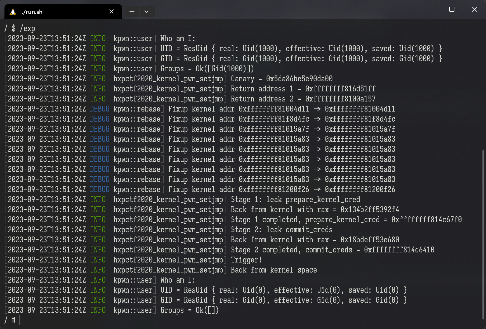

A Rust library that tries to make kernel exploits simpler. Potentially handy for CTF competitions.

想尝试一下用 Rust 来做 Linux kernel pwn 题目的感觉吗？快来试试吧。

## How does it look like?

The following screenshot is an output of the example exploit `hxpctf2020-kernel-rop-setjmp`. It demonstrates the basic procedure of an FG-KASLR-oriented kernel exploit, pretty-printed by the `env_logger` Rust crate.



## Example exploits for CTF challenges

The [examples/](./examples/) directory contains solutions for several entry-level kernel CTF challenges, as listed below:

```sh
# Kernel ROP example
cargo build --release --example qwb2018-core
# UAF + struct cred overwrite
cargo build --release --example ciscn2017-babydriver-easy
# UAF + tty_struct exploit
cargo build --release --example ciscn2017-babydriver-hard
# ROP + ret2dir example
cargo build --release --example minilctf2022-kgadget
# FG-KASLR example (using the "setjmp" pattern)
cargo build --release --example hxpctf2020-kernel-rop-setjmp
```

Please read through their source code to gain a basic understanding of what this crate could do for you.

## Start your own exploit

```sh
# Clone this repo
git clone https://github.com/Kazurin-775/libkpwn-rs.git kpwn
# Copy exploit template
cp -R kpwn/template exp

# Start writing your exploit!
cd exp
vim src/main.rs

# Build and test
cargo build --release
ln -s ./target/x86_64-unknown-linux-musl/release/exp ./exp
# Send the exploit to VM via network
nc -lNvp 5678 < ./exp
# Inside the VM, run: nc $HOST_IP 5678 > /exp
```

## Features included

- A **kernel address rebaser** (for use after leaking KASLR), with a `fixup_all()` function to rebase a whole ROP chain at once (see [examples/qwb2018-core.rs](./examples/qwb2018-core.rs))
- Helper functions for **easier file operations**, such as:
    - Opening device files with `O_RDWR`
    - Opening `/dev/ptmx` with `O_RDWR | O_NOCTTY`
    - Directly reading data into a C struct
    - ... and more (see [src/file_ext.rs](./src/file_ext.rs))
- `ioctl(2)` with customized `struct pt_regs` (for easier kernel-mode stack pivoting; see [examples/minilctf2022-kgadget.rs](./examples/minilctf2022-kgadget.rs)). Say farewell to those complicated `__asm__ __volatile__()`s!
- Create x86\_64 **`iretq` stack frames** (i.e. RIP, CS, FLAGS, RSP, SS) with a single function call
- `execlp("sh")` or `whoami()` with a single function call
- `mmap(2)` spraying (for ret2dir)
- A minimum `setjmp()`-like context switcher, which allows you to **reuse local variables in multi-stage exploits** (which is super handy due to Rust's limitations on global variables)
